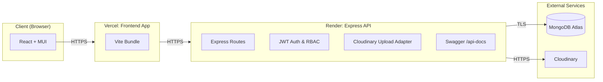
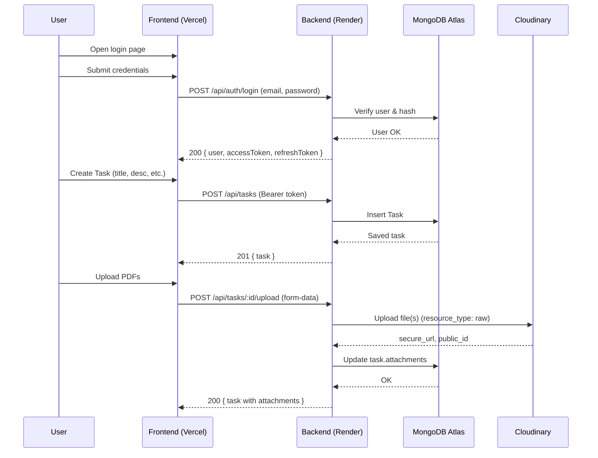
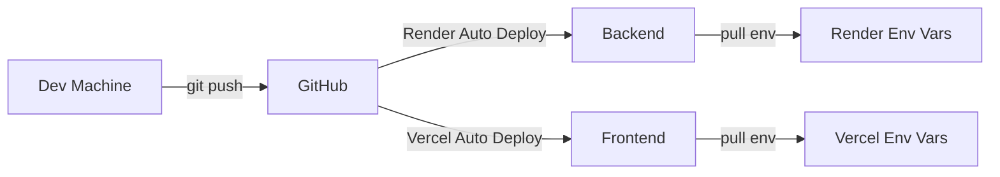

# Task Management System (Express + React + MongoDB + Cloudinary)

A production‑ready, full‑stack task management system with authentication (JWT), role‑based authorization, CRUD for users and tasks, file uploads to Cloudinary (PDFs), analytics dashboard, responsive UI (aligned, justified cards), Swagger API docs, Docker, and CI/CD‑friendly workflow.

This README is intentionally comprehensive. Use the table of contents to jump where you need.

---

## Table of Contents

- [Live Links](#live-links)
- [Screens & Features](#screens--features)
- [Tech Stack](#tech-stack)
- 
  - [High-Level System Diagram](#high-level-system-diagram)
  - [Runtime Sequence (Login → Task CRUD)](#runtime-sequence-login--task-crud)
  - [CI/CD Flow](#cicd-flow)
- [Monorepo Structure](#monorepo-structure)
- [Environment Variables](#environment-variables)
  - [Backend .env](#backend-env)
  - [Frontend .env](#frontend-env)
  - [Docker .env.docker](#docker-envdocker)
- [Installation & Local Development](#installation--local-development)
  - 
  - [Clone & Bootstrap](#clone--bootstrap)
  - [Run Backend (Dev)](#run-backend-dev)
  - [Run Frontend (Dev)](#run-frontend-dev)
- [Database (MongoDB Atlas)](#database-mongodb-atlas)
- [File Storage (Cloudinary)](#file-storage-cloudinary)
- [CORS & Production Origins](#cors--production-origins)
- [API Documentation (Swagger)](#api-documentation-swagger)
- 
  - [Backend (Jest + Supertest)](#backend-jest--supertest)
  - [Frontend (Vitest + React Testing Library)](#frontend-vitest--react-testing-library)
  - [End-to-End (Playwright)](#end-to-end-playwright)
- [Docker & Docker Compose](#docker--docker-compose)
- 
  - [Backend on Render](#backend-on-render)
  - [Frontend on Vercel](#frontend-on-vercel)
  - [Post-Deployment Checklist](#post-deployment-checklist)
- [Common Issues & Fixes](#common-issues--fixes)
- [Security Notes](#security-notes)
- [Performance Tips](#performance-tips)
- 
- 

---

## Live Links

- Frontend (Vercel):  
  https://task-management-system-frontend-gold.vercel.app

- Backend (Render):  
  https://task-management-system-517n.onrender.com

- Health Check:  
  https://task-management-system-517n.onrender.com/health

Note: If you redeploy to your own domains, update the links above and the environment variables accordingly.

---

## Screens & Features

- Auth: Register, Login, JWT access/refresh tokens, logout, protected routes
- Role-based authorization: admin vs user
- Tasks: Create, Read, Update, Delete
  - Assign to users, set status, priority, due date, tags, estimated hours
  - Comments on tasks (add/edit/delete)
  - Attach up to 3 PDFs; download and delete attachments
- Users (Admin):
  - List users with search, filters, pagination
  - Update role/status; delete users
- Dashboard:
  - Stats (total, completed, in‑progress, overdue)
  - Priority distribution
  - Quick actions
  - Recent activity placeholder
- Profile:
  - Overview with compact label:value rows
  - Edit name/email
  - Change password
- Settings:
  - Theme toggle (dark/light)
  - Notification mock toggles
  - Account info
- UI:
  - Responsive, justified cards (SectionCard pattern)
  - Aligned forms and layouts across pages
- Swagger docs & OpenAPI JSON

---

## Tech Stack

- Frontend: React 18, Vite, Material‑UI (MUI), Redux Toolkit, React Router
- Backend: Node.js, Express, Mongoose (MongoDB)
- Auth: JWT (access + refresh)
- Storage: Cloudinary (resource_type: raw for PDFs)
- Database: MongoDB Atlas
- Docs: Swagger (swagger-ui-express + swagger-jsdoc)
- Testing: Jest + Supertest (backend), Vitest + React Testing Library (frontend), Playwright (E2E)
- DevOps: Docker, Docker Compose, Render (backend), Vercel (frontend)

---

## Architecture

### High-Level System Diagram



### Runtime Sequence (Login → Task CRUD)



### CI/CD Flow



---

## Monorepo Structure

```text
task-management-system/
├── backend/
│   ├── src/
│   │   ├── config/         # database.js, cloudinary.js, swagger.js
│   │   ├── controllers/    # auth.controller.js, task.controller.js, user.controller.js
│   │   ├── middleware/     # auth.middleware.js, validation.middleware.js
│   │   ├── models/         # User.js, Task.js
│   │   ├── routes/         # index.js, auth.routes.js, task.routes.js, user.routes.js
│   │   └── index.js        # Express server
│   ├── package.json
│   └── .env.example
├── frontend/
│   ├── src/
│   │   ├── components/     # SectionCard, FileUpload, etc.
│   │   ├── pages/          # auth, dashboard, tasks, users, profile, settings
│   │   ├── services/       # api.js, taskService.js, userService.js, authService.js
│   │   ├── store/          # Redux slices
│   │   └── App.jsx, main.jsx
│   ├── package.json
│   └── .env.example
├── docker-compose.yml
├── render.yaml (optional)
├── package.json             # npm workspaces
└── README.md
```

---

## Environment Variables

### Backend `.env`

```
NODE_ENV=development
PORT=5000

# MongoDB Atlas
MONGODB_URI=mongodb+srv://<user>:<password>@<cluster>.mongodb.net/taskdb?retryWrites=true&w=majority

# JWT
JWT_SECRET=<long-random-string>
JWT_REFRESH_SECRET=<long-random-string>

# Cloudinary
CLOUDINARY_CLOUD_NAME=<cloud_name>
CLOUDINARY_API_KEY=<api_key>
CLOUDINARY_API_SECRET=<api_secret>

# CORS allowed frontend origin
FRONTEND_URL=http://localhost:5173

# (Optional) Swagger server url
API_BASE_URL=http://localhost:5000
```

### Frontend `.env`

```
VITE_API_URL=http://localhost:5000/api
# Optional if you have websockets:
# VITE_WS_URL=ws://localhost:5000/ws
```

### Docker `.env.docker`

```
# Mongo (if using local docker mongo)
MONGO_INITDB_ROOT_USERNAME=admin
MONGO_INITDB_ROOT_PASSWORD=password123
MONGO_INITDB_DATABASE=taskdb

# Backend
NODE_ENV=production
PORT=5000
JWT_SECRET=<prod-jwt>
JWT_REFRESH_SECRET=<prod-refresh>

# Cloudinary
CLOUDINARY_CLOUD_NAME=<cloud_name>
CLOUDINARY_API_KEY=<api_key>
CLOUDINARY_API_SECRET=<api_secret>

# Frontend URL (docker dev)
FRONTEND_URL=http://localhost:3000

# Frontend build API
VITE_API_URL=http://localhost:5000/api
```

---

## Installation & Local Development

### Prerequisites

- Node.js 18+ (you have 22, good)
- npm 9+ (you have 11, good)
- Git
- Optional: Docker Desktop (for Docker setup)

### Clone & Bootstrap

```bash
git clone https://github.com/<your-username>/task-management-system.git
cd task-management-system

# install workspace deps
npm install
```

Create env files:

```bash
# Backend env
cp backend/.env.example backend/.env
# edit backend/.env with your Atlas + Cloudinary credentials

# Frontend env
cp frontend/.env.example frontend/.env
# edit frontend/.env if needed
```

### Run Backend (Dev)

```bash
npm run dev:backend
# server at http://localhost:5000
# health: http://localhost:5000/health
```

### Run Frontend (Dev)

```bash
npm run dev:frontend
# Vite dev server at http://localhost:5173
```

Open http://localhost:5173 and test register/login.

---

## Database (MongoDB Atlas)

1. Create cluster (FREE tier) at https://cloud.mongodb.com  
2. Create DB user (readWRITE, strong password)  
3. Network Access: allow 0.0.0.0/0 (for quick start; restrict later)  
4. Connection string: use SRV, include `taskdb` database name  
5. Set `MONGODB_URI` in backend `.env` and in Render env

---

## File Storage (Cloudinary)

1. Create account at https://cloudinary.com  
2. Note credentials (Cloud name, API key, secret)  
3. In backend `.env` set:
   - `CLOUDINARY_CLOUD_NAME`, `CLOUDINARY_API_KEY`, `CLOUDINARY_API_SECRET`
4. Uploads use `resource_type: 'raw'` for PDFs; metadata saved in Mongo.

---

## CORS & Production Origins

- Backend must allow your frontend origin:
  - In backend `index.js` CORS setup, whitelisted: `FRONTEND_URL`
  - On Render (backend) set `FRONTEND_URL=https://<your-frontend>.vercel.app`
- Frontend must point to backend API:
  - On Vercel (frontend) set `VITE_API_URL=https://<your-backend>.onrender.com/api`

---

## Testing

### Backend (Jest + Supertest)

Install (already present in many setups):

```bash
# if missing
npm i -D jest supertest cross-env --workspace=backend
```

Example test script in `backend/package.json`:

```json
"scripts": {
  "test": "cross-env NODE_ENV=test jest --runInBand --detectOpenHandles --coverage"
}
```

Basic sample: `backend/src/__tests__/auth.test.js`

```js
const request = require('supertest');
const app = require('../index'); // export app in index.js for test or create a separate app export

describe('Auth', () => {
  it('should fail register with missing fields', async () => {
    const res = await request(app).post('/api/auth/register').send({});
    expect([400, 422]).toContain(res.statusCode);
  });
});
```

Run:

```bash
npm run test --workspace=backend
```

### Frontend (Vitest + React Testing Library)

Scripts in `frontend/package.json`:

```json
"scripts": {
  "test": "vitest --environment jsdom --coverage",
  "test:ui": "vitest --ui"
}
```

Example test: `frontend/src/__tests__/App.test.jsx`

```jsx
import { render, screen } from '@testing-library/react';
import App from '../App';
import { Provider } from 'react-redux';
import { store } from '../store';
import { BrowserRouter } from 'react-router-dom';

test('renders login title', () => {
  render(
    <Provider store={store}>
      <BrowserRouter>
        <App />
      </BrowserRouter>
    </Provider>
  );
  expect(screen.getByText(/Sign In/i)).toBeInTheDocument();
});
```

Run:

```bash
npm run test --workspace=frontend
```

### End-to-End (Playwright)

```bash
# if missing
npm i -D @playwright/test --workspace=frontend
npx playwright install
```

`frontend/playwright.config.ts`:

```ts
import { defineConfig, devices } from '@playwright/test';
export default defineConfig({
  testDir: './e2e',
  use: { baseURL: 'http://localhost:5173' },
  projects: [ { name: 'chromium', use: { ...devices['Desktop Chrome'] } } ],
});
```

Simple E2E: `frontend/e2e/auth.spec.ts`:

```ts
import { test, expect } from '@playwright/test';

test('login page renders', async ({ page }) => {
  await page.goto('/login');
  await expect(page.getByRole('heading', { name: /sign in/i })).toBeVisible();
});
```

Run:

```bash
npm run dev:frontend  # start Vite
# In another terminal:
npx playwright test --workspace=frontend
```

---

## Docker & Docker Compose

Build and run (dev-ish stack):

```bash
docker-compose up --build
# Frontend at http://localhost:3000
# Backend at http://localhost:5000
```

If using Atlas in docker, update `docker-compose.yml` backend `MONGODB_URI` to Atlas string and comment out local mongo service.

---

## Deployment

### Backend on Render

- New Web Service → connect GitHub
- Root Directory: `backend`
- Build: `npm install`
- Start: `npm start`
- Health Check: `/health`
- Env Vars:
  - `NODE_ENV=production`
  - `PORT=5000`
  - `MONGODB_URI=<atlas-uri-with-taskdb>`
  - `JWT_SECRET`, `JWT_REFRESH_SECRET`
  - `CLOUDINARY_*`
  - `FRONTEND_URL=https://<your-frontend>.vercel.app`

### Frontend on Vercel

- New Project → import repo
- Root Directory: `frontend`
- Build: `npm run build`
- Output: `dist`
- Env Vars:
  - `VITE_API_URL=https://<your-backend>.onrender.com/api`

### Post-Deployment Checklist

- Backend `/health` returns 200
- Frontend can register/login
- Tasks list loads; CRUD works
- File upload/download works
- No CORS errors (if yes, check `FRONTEND_URL` and `VITE_API_URL`)

---

## Common Issues & Fixes

- CORS error from Vercel → Render
  - Backend `FRONTEND_URL` must equal your Vercel domain (no trailing slash)
  - Backend must handle preflight: `app.options('*', cors(corsOptions))`
  - Frontend must target `VITE_API_URL=https://<backend>/api`

- path-to-regexp “Missing parameter name”
  - You accidentally used a full URL in a route path:
    - Wrong: `app.use('https://your-frontend.vercel.app', ...)`
    - Right: `app.use('/api', ...)`
  - Search for lines with `app.use(` or `router.use(` that include `http(s)://` and fix.

- Cloudinary “Customer is untrusted”
  - Verify email; add billing if Cloudinary prompts for trust
  - Credentials must match dashboard

- MongoDB “Authentication failed”
  - MONGODB_URI user/pass wrong or contains special chars not URL‑encoded
  - Atlas Network Access not open to Render (0.0.0.0/0 temporarily)

---

## Security Notes

- Never commit real `.env` files; use `.env.example` templates
- Use long, random `JWT_SECRET` and `JWT_REFRESH_SECRET`
- Limit allowed origin(s) in CORS
- Consider rate limits on `/api/auth/*`
- Validate inputs with `express-validator` (already used)
- Sanitize filenames and enforce `application/pdf` for uploads

---

## Performance Tips

- Use `compression()` (enabled)
- Keep indexes on Mongo fields used in filters (`status`, `priority`, `assignedTo`, etc.)
- Cache non‑sensitive GETs if needed
- Avoid large PDF uploads (limit to 5 MB and max 3 files)

---

## Roadmap

- WebSockets for real-time updates (task status, comments)
- Email notifications (task assignment, due reminders)
- Invite links and password reset flows
- Better analytics (charts, trends)
- Granular permissions (managers, viewers)
- i18n (multi-language)

---

## License

MIT © 2025 Manu Tyagi

