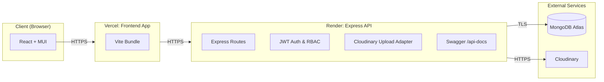
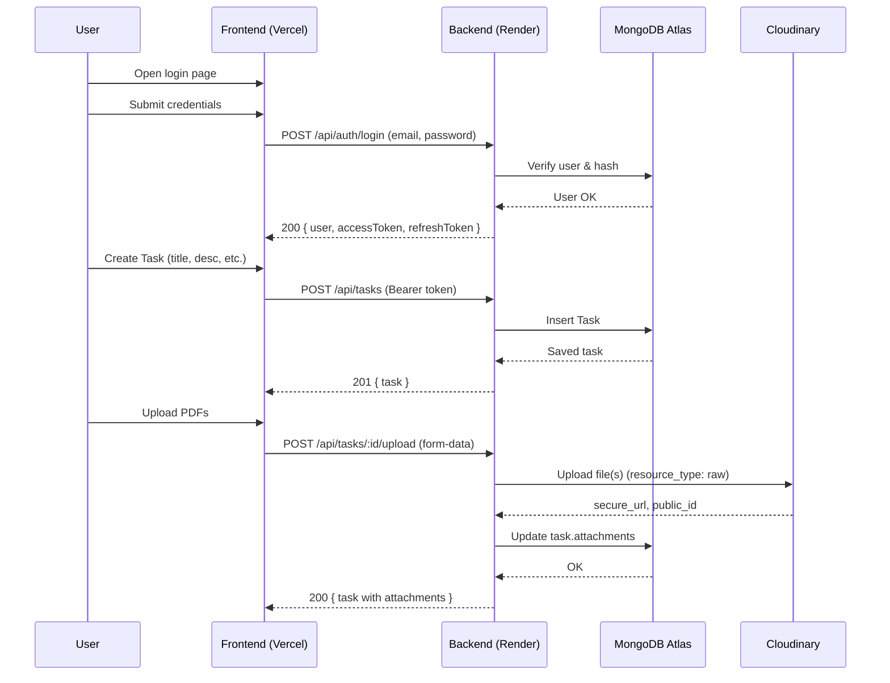
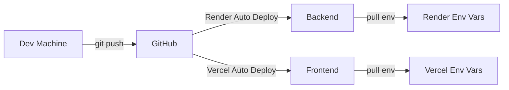

# Task Management System (Express + React + MongoDB + Cloudinary)

[](https://choosealicense.com/licenses/mit/)
[](https://nodejs.org/)
[](https://react.dev/)
[](https://www.mongodb.com/atlas)
[](https://vercel.com)
[](https://render.com)


## Screenshots

<p align="center">    </p>

<p align="center">    </p>

<p align="center">    </p>

## Context

A production‑ready, full‑stack task management system with authentication (JWT), role‑based authorization, CRUD for users and tasks, file uploads to Cloudinary (PDFs), analytics dashboard, responsive UI (aligned, justified cards), Swagger API docs, Docker, and CI/CD‑friendly workflow.

This README is intentionally comprehensive. Use the table of contents to jump where you need.

**🔗 GitHub Repository:** [https://github.com/Manu-Tyagi90/task-management-system](https://github.com/Manu-Tyagi90/task-management-system)

---

## Table of Contents

- [Quick Start](#quick-start)
- [Live Links](#live-links)
- [Screens & Features](#screens--features)
- [Tech Stack](#tech-stack)
- [Architecture](#architecture)
  - [High-Level System Diagram](#high-level-system-diagram)
  - [Runtime Sequence (Login → Task CRUD)](#runtime-sequence-login--task-crud)
  - [CI/CD Flow](#cicd-flow)
- [Monorepo Structure](#monorepo-structure)
- [Environment Variables](#environment-variables)
  - [Backend .env](#backend-env)
  - [Frontend .env](#frontend-env)
  - [Docker .env.docker](#docker-envdocker)
- [Installation & Local Development](#installation--local-development)
  - [Prerequisites](#prerequisites)
  - [Clone & Bootstrap](#clone--bootstrap)
  - [Run Backend (Dev)](#run-backend-dev)
  - [Run Frontend (Dev)](#run-frontend-dev)
- [Database (MongoDB Atlas)](#database-mongodb-atlas)
- [File Storage (Cloudinary)](#file-storage-cloudinary)
- [CORS & Production Origins](#cors--production-origins)
- [API Documentation (Swagger)](#api-documentation-swagger)
- [Testing](#testing)
  - [Backend (Jest + Supertest)](#backend-jest--supertest)
  - [Frontend (Vitest + React Testing Library)](#frontend-vitest--react-testing-library)
  - [End-to-End (Playwright)](#end-to-end-playwright)
- [Docker & Docker Compose](#docker--docker-compose)
- [Deployment](#deployment)
  - [Backend on Render](#backend-on-render)
  - [Frontend on Vercel](#frontend-on-vercel)
  - [Post-Deployment Checklist](#post-deployment-checklist)
- [Common Issues & Fixes](#common-issues--fixes)
- [Security Notes](#security-notes)
- [Performance Tips](#performance-tips)
- [API Endpoints](#api-endpoints)
- [Contributing](#contributing)
- [Roadmap](#roadmap)
- [Support](#support)
- [License](#license)

---

## Quick Start

```bash
# Clone the repository
git clone https://github.com/Manu-Tyagi90/task-management-system.git
cd task-management-system

# Install dependencies
npm install

# Setup environment variables
cp backend/.env.example backend/.env
cp frontend/.env.example frontend/.env

# Run both frontend and backend
npm run dev

# Open http://localhost:5173
```

---

## Live Links

- **Frontend (Vercel):**  
  https://task-management-system-frontend-gold.vercel.app

- **Backend (Render):**  
  https://task-management-system-517n.onrender.com

- **Health Check:**  
  https://task-management-system-517n.onrender.com/health

- **GitHub Repository:**  
  https://github.com/Manu-Tyagi90/task-management-system

Note: If you redeploy to your own domains, update the links above and the environment variables accordingly.

---

## Screens & Features

### 🔐 Authentication & Authorization
- **Register**: New user registration with validation
- **Login**: JWT-based authentication with access/refresh tokens
- **Protected Routes**: Automatic token refresh and route protection
- **Role-based Access**: Admin vs User permissions

### 📋 Task Management
- **CRUD Operations**: Create, Read, Update, Delete tasks
- **Advanced Features**:
  - Assign tasks to users
  - Set status (todo, in-progress, completed)
  - Priority levels (low, medium, high)
  - Due dates with overdue tracking
  - Tags for categorization
  - Estimated hours tracking
- **Comments System**: Add, edit, delete comments on tasks
- **File Attachments**: Upload up to 3 PDFs per task via Cloudinary

### 👥 User Management (Admin Only)
- List all users with search and filters
- Pagination for large datasets
- Update user roles and status
- Delete users

### 📊 Dashboard
- **Statistics Cards**: Total, completed, in-progress, and overdue tasks
- **Priority Distribution**: Visual breakdown of task priorities
- **Quick Actions**: Fast access to common operations
- **Recent Activity**: Activity feed placeholder

### 👤 Profile Management
- View profile overview with compact label:value layout
- Edit personal information (name, email)
- Change password with validation

### ⚙️ Settings
- **Theme Toggle**: Dark/Light mode
- **Notification Preferences**: Mock notification toggles
- **Account Information**: View account details

### 🎨 UI/UX Features
- Responsive design with Material-UI
- Justified card layouts (SectionCard pattern)
- Aligned forms across all pages
- Loading states and error handling
- Toast notifications for user feedback

### 📚 API Documentation
- Interactive Swagger UI at `/api-docs`
- OpenAPI 3.0 specification
- Try-out functionality for all endpoints

---

## Tech Stack

### Frontend
- **Framework**: React 18 with Hooks
- **Build Tool**: Vite 5
- **UI Library**: Material-UI (MUI) v5
- **State Management**: Redux Toolkit
- **Routing**: React Router v6
- **HTTP Client**: Axios
- **Form Handling**: React Hook Form
- **Date Handling**: Day.js

### Backend
- **Runtime**: Node.js v18+
- **Framework**: Express.js
- **Database**: MongoDB with Mongoose ODM
- **Authentication**: JWT (jsonwebtoken)
- **Password Hashing**: bcryptjs
- **File Upload**: Multer + Cloudinary
- **Validation**: express-validator
- **Documentation**: Swagger (swagger-ui-express + swagger-jsdoc)
- **Security**: Helmet, CORS, compression

### Infrastructure
- **Database**: MongoDB Atlas (Cloud)
- **File Storage**: Cloudinary CDN
- **Backend Hosting**: Render
- **Frontend Hosting**: Vercel
- **Version Control**: Git + GitHub
- **CI/CD**: GitHub Actions (optional)

### Development Tools
- **Testing**: Jest, Supertest, Vitest, React Testing Library, Playwright
- **Containerization**: Docker & Docker Compose
- **Code Quality**: ESLint, Prettier
- **Package Management**: npm workspaces

---

## Architecture

### High-Level System Diagram



### Runtime Sequence (Login → Task CRUD)



### CI/CD Flow



---

## Monorepo Structure

```text
task-management-system/
├── backend/
│   ├── src/
│   │   ├── config/         # database.js, cloudinary.js, swagger.js
│   │   ├── controllers/    # auth.controller.js, task.controller.js, user.controller.js
│   │   ├── middleware/     # auth.middleware.js, validation.middleware.js
│   │   ├── models/         # User.js, Task.js
│   │   ├── routes/         # index.js, auth.routes.js, task.routes.js, user.routes.js
│   │   ├── utils/          # helper functions, email, etc.
│   │   └── index.js        # Express server
│   ├── tests/              # Test files
│   ├── package.json
│   └── .env.example
├── frontend/
│   ├── src/
│   │   ├── components/     # SectionCard, FileUpload, etc.
│   │   ├── pages/          # auth, dashboard, tasks, users, profile, settings
│   │   ├── services/       # api.js, taskService.js, userService.js, authService.js
│   │   ├── store/          # Redux slices
│   │   ├── utils/          # helpers, formatters
│   │   ├── hooks/          # custom React hooks
│   │   └── App.jsx, main.jsx
│   ├── public/             # Static assets
│   ├── tests/              # Test files
│   ├── package.json
│   ├── vite.config.js
│   └── .env.example
├── docker-compose.yml
├── render.yaml (optional)
├── vercel.json             # Vercel configuration
├── package.json            # npm workspaces
├── .gitignore
├── LICENSE
└── README.md
```

---

## Environment Variables

### Backend `.env`

```bash
NODE_ENV=development
PORT=5000

# MongoDB Atlas
MONGODB_URI=mongodb+srv://<user>:<password>@<cluster>.mongodb.net/taskdb?retryWrites=true&w=majority

# JWT
JWT_SECRET=<long-random-string>
JWT_REFRESH_SECRET=<long-random-string>
JWT_EXPIRE=1d
JWT_REFRESH_EXPIRE=7d

# Cloudinary
CLOUDINARY_CLOUD_NAME=<cloud_name>
CLOUDINARY_API_KEY=<api_key>
CLOUDINARY_API_SECRET=<api_secret>

# CORS allowed frontend origin
FRONTEND_URL=http://localhost:5173

```

### Frontend `.env`

```bash
VITE_API_URL=http://localhost:5000/api
VITE_APP_NAME=Task Management System
# Optional if you have websockets:
# VITE_WS_URL=ws://localhost:5000/ws
```

### Docker `.env.docker`

```bash
# Mongo (if using local docker mongo)
MONGO_INITDB_ROOT_USERNAME=admin
MONGO_INITDB_ROOT_PASSWORD=password123
MONGO_INITDB_DATABASE=taskdb

# Backend
NODE_ENV=production
PORT=5000
JWT_SECRET=<prod-jwt>
JWT_REFRESH_SECRET=<prod-refresh>

# Cloudinary
CLOUDINARY_CLOUD_NAME=<cloud_name>
CLOUDINARY_API_KEY=<api_key>
CLOUDINARY_API_SECRET=<api_secret>

# Frontend URL (docker dev)
FRONTEND_URL=http://localhost:3000

# Frontend build API
VITE_API_URL=http://localhost:5000/api
```

---

## Installation & Local Development

### Prerequisites

- **Node.js**: v18+ (LTS recommended)
- **npm**: v9+ 
- **Git**: Latest version
- **MongoDB Atlas Account**: Free tier works
- **Cloudinary Account**: Free tier works
- **Optional**: Docker Desktop for containerized development

### Clone & Bootstrap

```bash
# Clone the repository
git clone https://github.com/Manu-Tyagi90/task-management-system.git
cd task-management-system

# Install workspace dependencies
npm install

# Install backend dependencies
cd backend && npm install && cd ..

# Install frontend dependencies  
cd frontend && npm install && cd ..
```

Create environment files:

```bash
# Backend environment
cp backend/.env.example backend/.env
# Edit backend/.env with your MongoDB Atlas + Cloudinary credentials

# Frontend environment
cp frontend/.env.example frontend/.env
# Edit frontend/.env if needed (usually just for API URL)
```

### Run Backend (Dev)

```bash
# From root directory
npm run dev:backend

# Or from backend directory
cd backend
npm run dev

# Server runs at http://localhost:5000
# Health check: http://localhost:5000/health
# API docs: http://localhost:5000/api-docs
```

### Run Frontend (Dev)

```bash
# From root directory
npm run dev:frontend

# Or from frontend directory
cd frontend
npm run dev

# Vite dev server at http://localhost:5173
```

### Run Both Concurrently

```bash
# From root directory
npm run dev
# Starts both frontend and backend
```

Open http://localhost:5173 and test register/login.

---

## Database (MongoDB Atlas)

### Setup Steps

1. **Create Account**: Go to [MongoDB Atlas](https://cloud.mongodb.com)
2. **Create Cluster**: 
   - Choose FREE tier (M0 Sandbox)
   - Select nearest region
3. **Database User**:
   - Username: `taskdbuser` (or your choice)
   - Password: Strong, auto-generated
   - Privileges: Read and write to any database
4. **Network Access**:
   - For development: Allow `0.0.0.0/0` (access from anywhere)
   - For production: Add specific IPs (Render IPs)
5. **Connection String**:
   ```
   mongodb+srv://taskdbuser:<password>@cluster0.xxxxx.mongodb.net/taskdb?retryWrites=true&w=majority
   ```
6. **Set in Environment**:
   - Local: Add to `backend/.env`
   - Production: Add to Render environment variables

### Database Schema

**User Collection:**
```javascript
{
  name: String,
  email: String (unique),
  password: String (hashed),
  role: String (admin/user),
  status: String (active/inactive),
  avatar: String,
  createdAt: Date,
  updatedAt: Date
}
```

**Task Collection:**
```javascript
{
  title: String,
  description: String,
  assignedTo: ObjectId (User),
  createdBy: ObjectId (User),
  status: String (todo/in-progress/completed),
  priority: String (low/medium/high),
  dueDate: Date,
  tags: [String],
  estimatedHours: Number,
  attachments: [{
    filename: String,
    url: String,
    public_id: String,
    uploadedAt: Date
  }],
  comments: [{
    user: ObjectId,
    text: String,
    createdAt: Date
  }],
  createdAt: Date,
  updatedAt: Date
}
```

---

## File Storage (Cloudinary)

### Setup Steps

1. **Create Account**: Go to [Cloudinary](https://cloudinary.com)
2. **Get Credentials**: From dashboard, note:
   - Cloud Name
   - API Key  
   - API Secret
3. **Configure Backend**:
   ```javascript
   // backend/.env
   CLOUDINARY_CLOUD_NAME=your_cloud_name
   CLOUDINARY_API_KEY=your_api_key
   CLOUDINARY_API_SECRET=your_api_secret
   ```
4. **Usage Pattern**:
   - PDFs uploaded with `resource_type: 'raw'`
   - Max file size: 5MB
   - Max files per task: 3
   - Metadata stored in MongoDB

### Upload Configuration

```javascript
// backend/src/config/cloudinary.js
const storage = new CloudinaryStorage({
  cloudinary: cloudinary,
  params: {
    folder: 'task-attachments',
    resource_type: 'raw',
    allowed_formats: ['pdf'],
    transformation: []
  }
});
```

---

## CORS & Production Origins

### Backend CORS Configuration

```javascript
// backend/src/index.js
app.use(cors({
  origin: function(origin, callback) {
    const allowedOrigins = [
      'http://localhost:5173',  // Vite dev
      'http://localhost:3000',  // Alternative dev
      process.env.FRONTEND_URL  // Production
    ].filter(Boolean);
    
    if (!origin || allowedOrigins.includes(origin)) {
      callback(null, true);
    } else {
      callback(new Error('Not allowed by CORS'));
    }
  },
  credentials: true,
  methods: ['GET', 'POST', 'PUT', 'DELETE', 'PATCH', 'OPTIONS'],
  allowedHeaders: ['Content-Type', 'Authorization']
}));
```

### Production Settings

**On Render (Backend):**
```bash
FRONTEND_URL=https://task-management-system-frontend-gold.vercel.app
```

**On Vercel (Frontend):**
```bash
VITE_API_URL=https://task-management-system-517n.onrender.com/api
```

---

## API Documentation (Swagger)

### Access Points

- **Local**: http://localhost:5000/api-docs
- **Production**: https://task-management-system-517n.onrender.com/api-docs
- **OpenAPI JSON**: `/api-docs.json`

### Features

- Interactive UI with Swagger UI
- Try-out functionality with authentication
- Request/Response examples
- Schema definitions
- Authentication flow documentation

---

## API Endpoints

### Authentication
```
POST   /api/auth/register     - Register new user
POST   /api/auth/login        - Login user
POST   /api/auth/refresh      - Refresh access token
POST   /api/auth/logout       - Logout user
```

### Tasks
```
GET    /api/tasks             - Get all tasks (with filters)
GET    /api/tasks/:id         - Get single task
POST   /api/tasks             - Create new task
PUT    /api/tasks/:id         - Update task
DELETE /api/tasks/:id         - Delete task
POST   /api/tasks/:id/upload  - Upload attachments
DELETE /api/tasks/:id/attachments/:attachmentId - Delete attachment
POST   /api/tasks/:id/comments - Add comment
PUT    /api/tasks/:id/comments/:commentId - Edit comment
DELETE /api/tasks/:id/comments/:commentId - Delete comment
```

### Users (Admin)
```
GET    /api/users             - Get all users
GET    /api/users/:id         - Get single user
PUT    /api/users/:id         - Update user
DELETE /api/users/:id         - Delete user
```

### Profile
```
GET    /api/profile           - Get current user profile
PUT    /api/profile           - Update profile
PUT    /api/profile/password  - Change password
```

### System
```
GET    /                      - API info
GET    /health                - Health check
GET    /api/stats             - Dashboard statistics
```

---

## Testing

### Backend (Jest + Supertest)

Install dependencies:
```bash
cd backend
npm i -D jest supertest cross-env @types/jest
```

Configuration (`backend/jest.config.js`):
```javascript
module.exports = {
  testEnvironment: 'node',
  coverageDirectory: 'coverage',
  collectCoverageFrom: [
    'src/**/*.js',
    '!src/index.js'
  ],
  testMatch: ['**/__tests__/**/*.test.js'],
  testTimeout: 10000
};
```

Example test (`backend/src/__tests__/auth.test.js`):
```javascript
const request = require('supertest');
const app = require('../index');
const mongoose = require('mongoose');

describe('Auth Endpoints', () => {
  beforeAll(async () => {
    await mongoose.connect(process.env.MONGODB_URI_TEST);
  });

  afterAll(async () => {
    await mongoose.connection.close();
  });

  describe('POST /api/auth/register', () => {
    it('should register a new user', async () => {
      const res = await request(app)
        .post('/api/auth/register')
        .send({
          name: 'Test User',
          email: 'test@example.com',
          password: 'Test123!'
        });
      expect(res.statusCode).toBe(201);
      expect(res.body).toHaveProperty('user');
      expect(res.body).toHaveProperty('accessToken');
    });
  });
});
```

Run tests:
```bash
npm run test --workspace=backend
npm run test:coverage --workspace=backend
```

### Frontend (Vitest + React Testing Library)

Install dependencies:
```bash
cd frontend
npm i -D vitest @testing-library/react @testing-library/jest-dom @testing-library/user-event jsdom
```

Configuration (`frontend/vite.config.js`):
```javascript
import { defineConfig } from 'vite';
import react from '@vitejs/plugin-react';

export default defineConfig({
  plugins: [react()],
  test: {
    globals: true,
    environment: 'jsdom',
    setupFiles: './src/test/setup.js',
    coverage: {
      reporter: ['text', 'json', 'html']
    }
  }
});
```

Example test (`frontend/src/__tests__/Login.test.jsx`):
```jsx
import { render, screen, fireEvent, waitFor } from '@testing-library/react';
import { Provider } from 'react-redux';
import { BrowserRouter } from 'react-router-dom';
import Login from '../pages/auth/Login';
import { store } from '../store';

describe('Login Component', () => {
  it('renders login form', () => {
    render(
      <Provider store={store}>
        <BrowserRouter>
          <Login />
        </BrowserRouter>
      </Provider>
    );
    
    expect(screen.getByLabelText(/email/i)).toBeInTheDocument();
    expect(screen.getByLabelText(/password/i)).toBeInTheDocument();
    expect(screen.getByRole('button', { name: /sign in/i })).toBeInTheDocument();
  });
});
```

Run tests:
```bash
npm run test --workspace=frontend
npm run test:ui --workspace=frontend
```

### End-to-End (Playwright)

Install:
```bash
npm i -D @playwright/test --workspace=frontend
npx playwright install
```

Configuration (`frontend/playwright.config.ts`):
```typescript
import { defineConfig, devices } from '@playwright/test';

export default defineConfig({
  testDir: './e2e',
  fullyParallel: true,
  forbidOnly: !!process.env.CI,
  retries: process.env.CI ? 2 : 0,
  workers: process.env.CI ? 1 : undefined,
  reporter: 'html',
  use: {
    baseURL: 'http://localhost:5173',
    trace: 'on-first-retry',
  },
  projects: [
    { name: 'chromium', use: { ...devices['Desktop Chrome'] } },
    { name: 'firefox', use: { ...devices['Desktop Firefox'] } },
  ],
  webServer: {
    command: 'npm run dev',
    url: 'http://localhost:5173',
    reuseExistingServer: !process.env.CI,
  },
});
```

Example E2E test (`frontend/e2e/auth.spec.ts`):
```typescript
import { test, expect } from '@playwright/test';

test.describe('Authentication Flow', () => {
  test('should login successfully', async ({ page }) => {
    await page.goto('/login');
    
    await page.fill('input[name="email"]', 'test@example.com');
    await page.fill('input[name="password"]', 'Test123!');
    await page.click('button[type="submit"]');
    
    await expect(page).toHaveURL('/dashboard');
    await expect(page.locator('h1')).toContainText('Dashboard');
  });
});
```

Run E2E tests:
```bash
npx playwright test
npx playwright show-report
```

---

## Docker & Docker Compose

### Docker Configuration

**Backend Dockerfile:**
```dockerfile
# backend/Dockerfile
FROM node:18-alpine
WORKDIR /app
COPY package*.json ./
RUN npm ci --only=production
COPY . .
EXPOSE 5000
CMD ["npm", "start"]
```

**Frontend Dockerfile:**
```dockerfile
# frontend/Dockerfile
FROM node:18-alpine as builder
WORKDIR /app
COPY package*.json ./
RUN npm ci
COPY . .
RUN npm run build

FROM nginx:alpine
COPY --from=builder /app/dist /usr/share/nginx/html
COPY nginx.conf /etc/nginx/conf.d/default.conf
EXPOSE 80
CMD ["nginx", "-g", "daemon off;"]
```

### Docker Compose

```yaml
# docker-compose.yml
version: '3.8'

services:
  mongodb:
    image: mongo:6
    restart: always
    environment:
      MONGO_INITDB_ROOT_USERNAME: ${MONGO_USERNAME}
      MONGO_INITDB_ROOT_PASSWORD: ${MONGO_PASSWORD}
      MONGO_INITDB_DATABASE: taskdb
    volumes:
      - mongodb_data:/data/db
    ports:
      - "27017:27017"

  backend:
    build: ./backend
    restart: always
    ports:
      - "5000:5000"
    environment:
      NODE_ENV: production
      MONGODB_URI: mongodb://mongodb:27017/taskdb
      JWT_SECRET: ${JWT_SECRET}
      JWT_REFRESH_SECRET: ${JWT_REFRESH_SECRET}
      CLOUDINARY_CLOUD_NAME: ${CLOUDINARY_CLOUD_NAME}
      CLOUDINARY_API_KEY: ${CLOUDINARY_API_KEY}
      CLOUDINARY_API_SECRET: ${CLOUDINARY_API_SECRET}
      FRONTEND_URL: http://localhost:3000
    depends_on:
      - mongodb

  frontend:
    build: ./frontend
    restart: always
    ports:
      - "3000:80"
    environment:
      VITE_API_URL: http://localhost:5000/api
    depends_on:
      - backend

volumes:
  mongodb_data:
```

### Running with Docker

```bash
# Build and run all services
docker-compose up --build

# Run in detached mode
docker-compose up -d

# View logs
docker-compose logs -f

# Stop services
docker-compose down

# Stop and remove volumes
docker-compose down -v
```

---

## Deployment

### Backend on Render

1. **Create New Web Service**:
   - Connect GitHub repo: https://github.com/Manu-Tyagi90/task-management-system
   - Root Directory: `backend`
   - Build Command: `npm install`
   - Start Command: `npm start`

2. **Environment Variables**:
   ```bash
   NODE_ENV=production
   PORT=5000
   MONGODB_URI=mongodb+srv://...
   JWT_SECRET=your-secret-key
   JWT_REFRESH_SECRET=your-refresh-secret
   CLOUDINARY_CLOUD_NAME=your-cloud-name
   CLOUDINARY_API_KEY=your-api-key
   CLOUDINARY_API_SECRET=your-api-secret
   FRONTEND_URL=https://task-management-system-frontend-gold.vercel.app
   ```

3. **Health Check Path**: `/health`

4. **Auto-Deploy**: Enable for automatic deployments on push

### Frontend on Vercel

1. **Import Project**:
   - Import from GitHub: https://github.com/Manu-Tyagi90/task-management-system
   - Root Directory: `frontend`
   - Framework Preset: Vite

2. **Build Settings**:
   - Build Command: `npm run build`
   - Output Directory: `dist`

3. **Environment Variables**:
   ```bash
   VITE_API_URL=https://task-management-system-517n.onrender.com/api
   ```

4. **Add `vercel.json`** in frontend root:
   ```json
   {
     "rewrites": [
       { "source": "/(.*)", "destination": "/index.html" }
     ]
   }
   ```

### Post-Deployment Checklist

- [ ] Backend health check returns 200
- [ ] Swagger docs accessible at `/api-docs`
- [ ] Frontend loads without errors
- [ ] Login/Register works
- [ ] Tasks CRUD operations work
- [ ] File upload/download works
- [ ] No CORS errors in console
- [ ] Environment variables properly set
- [ ] MongoDB Atlas connection successful
- [ ] Cloudinary uploads working

---

## Common Issues & Fixes

### CORS Error from Vercel → Render

**Issue**: "Access to fetch at ... has been blocked by CORS policy"

**Fix**:
1. Ensure backend `FRONTEND_URL` matches your Vercel domain exactly (no trailing slash)
2. Add preflight handling:
   ```javascript
   app.options('*', cors(corsOptions));
   ```
3. Verify frontend `VITE_API_URL` is correct

### Vercel 404 on Routes

**Issue**: Direct navigation to routes like `/tasks` shows 404

**Fix**: Add `vercel.json` in frontend root:
```json
{
  "rewrites": [
    { "source": "/(.*)", "destination": "/index.html" }
  ]
}
```

### MongoDB Authentication Failed

**Issue**: "MongoServerError: Authentication failed"

**Fix**:
1. Check username/password in connection string
2. URL-encode special characters in password
3. Ensure Network Access includes `0.0.0.0/0` or specific IPs

### Cloudinary Upload Issues

**Issue**: "Upload preset not found" or "Unauthorized"

**Fix**:
1. Verify credentials match Cloudinary dashboard
2. Check email verification status
3. Ensure `resource_type: 'raw'` for PDFs

### Render Cold Start

**Issue**: First request after inactivity takes long

**Fix**:
1. This is normal for free tier
2. Consider upgrading to paid tier
3. Implement a keep-alive ping

### Environment Variables Not Loading

**Issue**: `undefined` values for env vars

**Fix**:
1. Check variable names match exactly
2. Restart server after changes
3. Use `console.log(process.env)` to debug
4. Ensure `.env` files are in correct directories

---

## Security Notes

### Best Practices Implemented

- ✅ JWT tokens with refresh mechanism
- ✅ Password hashing with bcrypt
- ✅ Input validation with express-validator
- ✅ SQL injection prevention with Mongoose
- ✅ XSS protection with Helmet
- ✅ CORS properly configured
- ✅ Environment variables for secrets
- ✅ HTTPS in production

### Additional Recommendations

1. **API Rate Limiting**:
   ```javascript
   const rateLimit = require('express-rate-limit');
   const limiter = rateLimit({
     windowMs: 15 * 60 * 1000, // 15 minutes
     max: 100 // limit each IP to 100 requests
   });
   app.use('/api/', limiter);
   ```

2. **MongoDB Security**:
   - Use connection string with TLS
   - Implement field-level encryption for sensitive data
   - Regular backups

3. **File Upload Security**:
   - Validate file types
   - Limit file size (currently 5MB)
   - Scan for malware (advanced)

4. **Authentication Enhancements**:
   - Implement 2FA
   - Password reset flow
   - Account lockout after failed attempts

---

## Performance Tips

### Current Optimizations

- ✅ Compression middleware enabled
- ✅ Database indexes on frequently queried fields
- ✅ Pagination for large datasets
- ✅ Lazy loading in frontend
- ✅ Code splitting with Vite

### Additional Optimizations

1. **Database Indexes**:
   ```javascript
   // In Task model
   taskSchema.index({ status: 1, priority: 1 });
   taskSchema.index({ assignedTo: 1 });
   taskSchema.index({ dueDate: 1 });
   ```

2. **Redis Caching** (future):
   ```javascript
   const redis = require('redis');
   const client = redis.createClient();
   
   // Cache frequently accessed data
   const cacheMiddleware = (req, res, next) => {
     // Implementation
   };
   ```

3. **CDN for Static Assets**:
   - Use Cloudflare or similar
   - Cache static resources

4. **Database Query Optimization**:
   - Use `.lean()` for read-only queries
   - Implement proper pagination
   - Use aggregation pipeline for complex queries

---

## Contributing

We welcome contributions! Please follow these steps:

1. **Fork the repository**: https://github.com/Manu-Tyagi90/task-management-system

2. **Create a feature branch**:
   ```bash
   git checkout -b feature/your-feature-name
   ```

3. **Make your changes**:
   - Follow existing code style
   - Add tests if applicable
   - Update documentation

4. **Commit with conventional commits**:
   ```bash
   git commit -m "feat: add new feature"
   git commit -m "fix: resolve issue with..."
   git commit -m "docs: update README"
   ```

5. **Push and create PR**:
   ```bash
   git push origin feature/your-feature-name
   ```

6. **PR Guidelines**:
   - Clear description of changes
   - Screenshots for UI changes
   - Link related issues

### Development Guidelines

- Use ESLint and Prettier
- Write meaningful commit messages
- Add JSDoc comments for functions
- Keep components small and focused
- Follow REST API conventions

---

## Roadmap

### Version 2.0 (Q2 2025)
- [ ] Real-time updates with WebSockets
- [ ] Email notifications (task assignments, due dates)
- [ ] Password reset flow
- [ ] Two-factor authentication
- [ ] Advanced search and filters

### Version 2.5 (Q3 2025)
- [ ] Team/Project management
- [ ] Gantt charts for project timeline
- [ ] Time tracking
- [ ] Recurring tasks
- [ ] Task templates

### Version 3.0 (Q4 2025)
- [ ] Mobile app (React Native)
- [ ] Offline support with sync
- [ ] AI-powered task suggestions
- [ ] Integration with calendar apps
- [ ] Slack/Teams integration

### Future Considerations
- GraphQL API option
- Microservices architecture
- Kubernetes deployment
- Multi-language support (i18n)
- Advanced analytics dashboard
- Custom workflows
- Audit logs

---

## Support

### Get Help

- **Documentation**: This README and API docs
- **Issues**: [GitHub Issues](https://github.com/Manu-Tyagi90/task-management-system/issues)
- **Discussions**: [GitHub Discussions](https://github.com/Manu-Tyagi90/task-management-system/discussions)
- **Email**: manutyagi90@gmail.com

### Report Issues

When reporting issues, please include:
- Description of the problem
- Steps to reproduce
- Expected vs actual behavior
- Screenshots if applicable
- Environment details (OS, browser, Node version)

### Feature Requests

We welcome feature requests! Please:
- Check existing issues first
- Describe the feature clearly
- Explain use cases
- Consider submitting a PR

---

## License

MIT © 2025 Manu Tyagi

This project is licensed under the MIT License - see the [LICENSE](https://github.com/Manu-Tyagi90/task-management-system/blob/main/LICENSE) file for details.

### MIT License Summary

- ✅ Commercial use
- ✅ Modification
- ✅ Distribution
- ✅ Private use

---

## Acknowledgments

- Thanks to all contributors
- Built with amazing open-source technologies
- Inspired by modern task management needs
- Special thanks to the React, Node.js, and MongoDB communities

---

## Author

**Manu Tyagi**
- GitHub: [@Manu-Tyagi90](https://github.com/Manu-Tyagi90)
- LinkedIn: [Manu Tyagi](https://linkedin.com/in/thoughtful-manu)
- Email: manutygii90@gmail.com

---

**Repository**: https://github.com/Manu-Tyagi90/task-management-system
